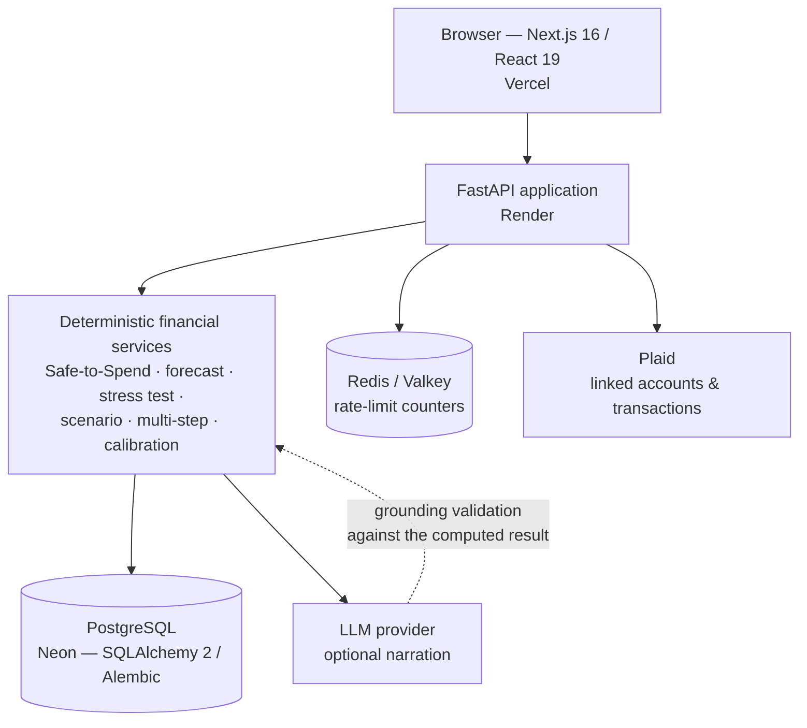

# Discero

*Discern before you decide.*

Discero is a financial decision intelligence platform. It helps you understand the
consequence of a financial decision — a major purchase, a temporary loss of income,
a multi-step plan — **before** you commit to it. Account, budget, goal, and
obligation data feed a deterministic simulation engine that reports how a proposed
decision would affect liquidity, upcoming obligations, savings goals, and financial
resilience. Results are computed by backend services in integer cents, not inferred
by a language model.

**Live demo — [discero-app.vercel.app](https://discero-app.vercel.app)**
&nbsp;·&nbsp; API — [finsigh.onrender.com](https://finsigh.onrender.com)
&nbsp;·&nbsp; [Architecture](docs/ARCHITECTURE.md)
&nbsp;·&nbsp; [Security](SECURITY.md)

The live demo ships with a seeded demo account so the decision tools can be explored
without connecting a real bank.

## Why Discero

Many personal finance apps are primarily backward-looking: they categorize what
already happened and show it on a dashboard. Discero focuses on the next question:
what could happen if you make a particular financial decision now?

Discero builds a forward-looking model of your finances and evaluates a proposed
decision against it. Instead of "you spent $X on dining last month", the question
becomes "if I buy this now, what does it do to my safe-to-spend, my emergency
runway, and my savings goal — and would waiting six weeks be materially better?"

## What it does

| Area | Capability |
|---|---|
| **Financial position** | Overview of balances, accounts, and net position; cash-flow forecast |
| **Safe-to-Spend** | Liquid balance minus upcoming recurring obligations, essential spend, and a safety reserve — the deterministic base every decision tool builds on |
| **Transactions** | Ingestion, search, and filtering; duplicate-transaction detection |
| **Planning inputs** | Budgets; savings goals; recurring obligations and income where supported |
| **Decision tools** | Major-purchase simulation; buy-now-vs-wait; scenario comparison; financial stress testing; what-if simulation; multi-step dated plans |
| **Resilience** | Emergency-runway modeling — how many months a loss of income would leave |
| **Decision lifecycle** | Decision history; acted-on status; outcome checking and calibration against what was originally simulated |
| **Ask Discero / Copilot** | Plain-language questions answered from deterministic results, with recommendations surfaced from the same engine |
| **Connectivity** | Plaid account linking; seeded demo account state |

Each capability is implemented as a dedicated backend service with targeted
regression coverage, not a variation of one generic calculator.

## Example decision flow

```
1. Current position   Safe-to-Spend, forecast, goal progress, emergency runway
                       are computed from account, budget, goal, and recurring data
        │
2. Proposed decision  "Buy a $2,400 laptop now" (or: lose income for 2 months,
                       or a 4-step plan over the next quarter)
        │
3. Deterministic       The relevant service simulates the decision in integer
   simulation          cents against a time-aware running balance
        │
4. Impact              Shortfall (if any), affected month, new safe-to-spend,
                       change to goal date and to months of runway
        │
5. Recommendation      Affordability classification + buy-now-vs-wait comparison
   + explanation       under identical assumptions; Copilot narrates the result
        │
6. Save / review       Decision is persisted; later, its original inputs are
                       re-run and predicted vs. actual is compared
```

Demo figures are seeded per environment; the README does not hard-code a specific
demo balance.

## Architecture



The backend is a modular monolith: one FastAPI deployable hosting domain-separated
routers and services (auth, financial data, decision intelligence, Copilot). The
LLM sits **downstream** of deterministic computation — it may narrate a result and
help select which tool to run, but it is never the financial source of truth.
See [docs/ARCHITECTURE.md](docs/ARCHITECTURE.md) for the detailed topology.

## Deterministic AI design

Financial truth is deterministic. Discero enforces that as an architectural rule:

- **The model does not compute financial values.** Balances, safe-to-spend,
  affordability, projections, goal impact, scenario results, confidence, and
  recommendations are produced only by deterministic backend services. The LLM
  selects tools and narrates their structured output.
- **Grounding validation.** Generated narration is checked against the real result
  payload; narration that is not traceable to the computed result is rejected and
  replaced with deterministic template text.
- **No identity in the tool schema.** The tools exposed to the model carry no user
  identifier — execution always scopes to the authenticated request's user, never
  to anything the model supplies.
- **Provider-optional.** With no provider configured, Copilot runs entirely on its
  deterministic router and template narration; the financial answer is identical
  whether or not an LLM is in the loop.

Grounding behavior has dedicated regression and evaluation tests, alongside
observability for token usage, estimated cost, and provider latency.

## Tech stack

| Layer | Technologies |
|---|---|
| **Frontend** | Next.js 16, React 19, TypeScript, Tailwind CSS 4, Framer Motion, Recharts, React Plaid Link |
| **Backend** | Python 3.12, FastAPI, SQLAlchemy 2, Pydantic 2, Alembic, PyJWT (JWT auth), Plaid |
| **Data** | PostgreSQL (Neon), Redis / Valkey |
| **Infrastructure** | Vercel (frontend), Render (backend), Docker |
| **AI** | Provider abstraction (Groq / Anthropic / deterministic free mode), deterministic tool routing, grounding validation |
| **Testing / quality** | pytest, Vitest + React Testing Library, Playwright, k6, GitHub Actions, CodeQL, Dependabot |

## Testing and reliability

| Suite | Result | Scope |
|---|---|---|
| Backend — pytest | **1354 passed** | auth, authorization, decision engines, Copilot grounding/evals, rate limiting, Plaid sync (external boundaries mocked) |
| Frontend — Vitest | **336 passed** | route surface, components, hooks |
| End-to-end — Playwright | **24 passed** (local + CI) | authenticated browser journeys |
| Production smoke | **7 passed** | read-only browser checks against the live production app |

These are separate suites with overlapping conceptual coverage; they are not summed
into a single total.

GitHub Actions runs the backend suite, frontend lint/test/build, and the Playwright
E2E job on every push to `main` and every pull request. CodeQL code scanning is
enabled and passing. Dependabot tracks pip, npm, and GitHub Actions dependencies
weekly.

## Performance

Read-only [k6 load test](loadtests/read-only.js) against the production backend on
its **current free-tier infrastructure**.

| VUs | Throughput | p95 latency | Errors |
|---:|---:|---:|---:|
| 5  | 9.80 req/s  | 305 ms  | 0% |
| 10 | 16.47 req/s | 613 ms  | 0% |
| 15 | 16.50 req/s | 1.48 s  | 0% |
| 20 | 15.42 req/s | 2.09 s  | 0% |
| 25 | 14.40 req/s | 2.21 s  | 0.18% |

The backend stays stable through roughly 15 concurrent read-heavy virtual
users — about **16.5 req/s at 1.48 s p95 with 0% errors**. Saturation begins around
20–25 VUs, where throughput plateaus, latency climbs, and a small error rate
appears. This is the measured saturation point of the current free-tier deployment, not a
measured architectural maximum. A larger backend instance or additional workers
would need to be load-tested separately to establish the next capacity level.

## Security

Verified properties of the current implementation:

- Passwords hashed with **Argon2** (pwdlib).
- Short-lived **JWT** Bearer access tokens (HS256) paired with an **HttpOnly**,
  origin-validated refresh-token cookie — refresh tokens are never in
  client-accessible storage.
- Server-side session invalidation via a per-user token version, bumped on
  password/email change and logout.
- Protected resource queries scoped to the authenticated user at both route and
  query layers; the LLM tool layer has no path to select whose data it touches.
- **Plaid access tokens encrypted at rest** (Fernet); safe account/status
  responses never expose provider identifiers or tokens.
- Redis/Valkey-backed distributed rate limiting with an in-process fallback on a
  Redis outage, applied by IP and by authenticated user on expensive endpoints.
- Nonce-based Content-Security-Policy on the frontend; HSTS, X-Frame-Options, and
  X-Content-Type-Options on the backend.
- Production configuration fails closed at startup: default secrets, wildcard or
  localhost CORS, or a missing encryption key refuse to boot when
  `APP_ENV=production`.

No regulatory or compliance claims are made. See [SECURITY.md](SECURITY.md) for the
full threat model, invariants, and residual risks.

## Running locally

**Requirements:** Python 3.12+, Node.js 20+, npm

```bash
# Backend
cd backend
python3 -m venv venv && source venv/bin/activate
pip install -r requirements.txt
cp .env.example .env   # set JWT_SECRET / TOKEN_ENCRYPTION_KEY — see comments in the file
alembic upgrade head
uvicorn app.main:app --reload
```

```bash
# Frontend
cd frontend
npm install
printf 'NEXT_PUBLIC_API_URL=http://localhost:8000\n' > .env.local
npm run dev
```

Backend: `http://localhost:8000` (Swagger at `/docs`) · Frontend: `http://localhost:3000`

Never commit `.env`, `.env.local`, database files, or real credentials. All values
in `.env.example` are placeholders.

## Deployment

| Component | Host |
|---|---|
| Frontend | Vercel — `https://discero-app.vercel.app` |
| Backend | Render — `https://finsigh.onrender.com` |
| Database | Managed PostgreSQL (Neon) |
| Rate-limit store | Render Valkey / Redis |
| Bank integration | Plaid |

`backend/start.sh` runs `alembic upgrade head` before starting Uvicorn on every
Render deploy, so traffic is never served against an un-migrated schema. The backend
exposes `/health` (liveness) and `/health/ready` (database connectivity) for the
host's health checks. Hosting-platform configuration (environment variables, branch
protection, secret scanning) lives in each platform's dashboard rather than in
source.

## Roadmap

- Broader real-bank integration testing beyond Plaid sandbox
- Infrastructure scaling off the free tier as load requires
- Deeper observability (structured tracing, external APM)
- Additional decision models and calibration signals
- Server-side refresh-token replay/family detection and encryption-key rotation for
  Plaid tokens

## Screenshots

<!-- Add screenshots to docs/assets/ and link them here. Suggested set: -->

- **Overview** — financial position, balances, forecast
- **Ask Discero** — Copilot answering a decision question
- **Decision Lab** — major-purchase / buy-now-vs-wait / stress test
- **Decision History** — saved decisions, acted-on status, outcome checks
- **Accounts** — Plaid connectivity and demo account state
- **Forecast** — cash-flow projection

## Disclaimer

Discero is an educational / personal engineering project. Financial simulations and
recommendations are informational estimates based on supplied data and are not
professional financial advice.

## Author

**Badrinath T** — Software Engineer focused on backend systems, cloud platforms,
distributed systems, and AI-enabled applications.
