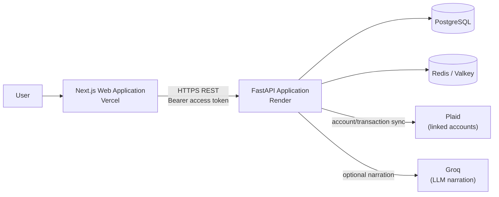
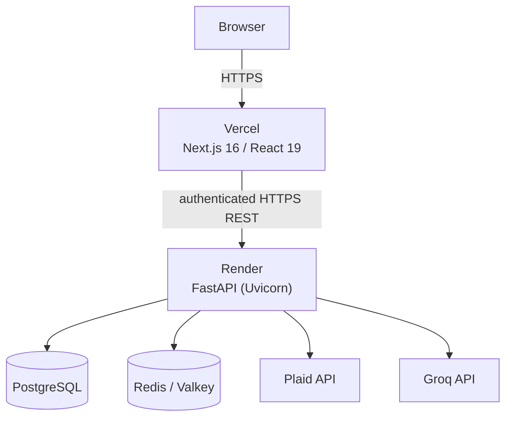
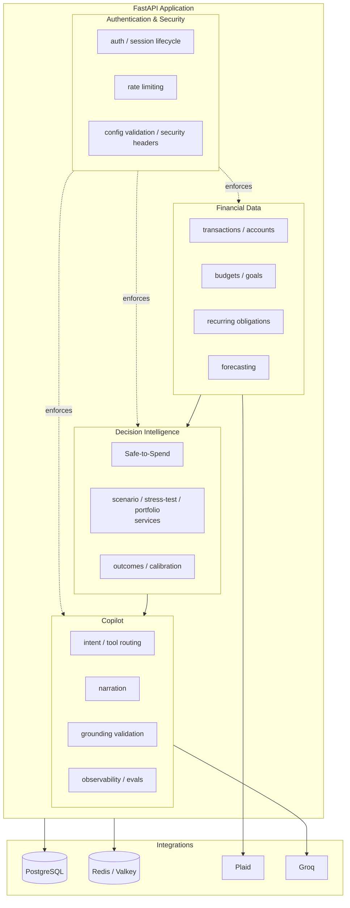
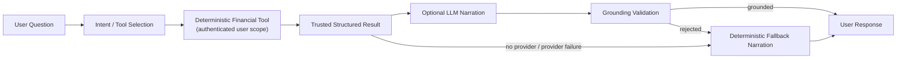
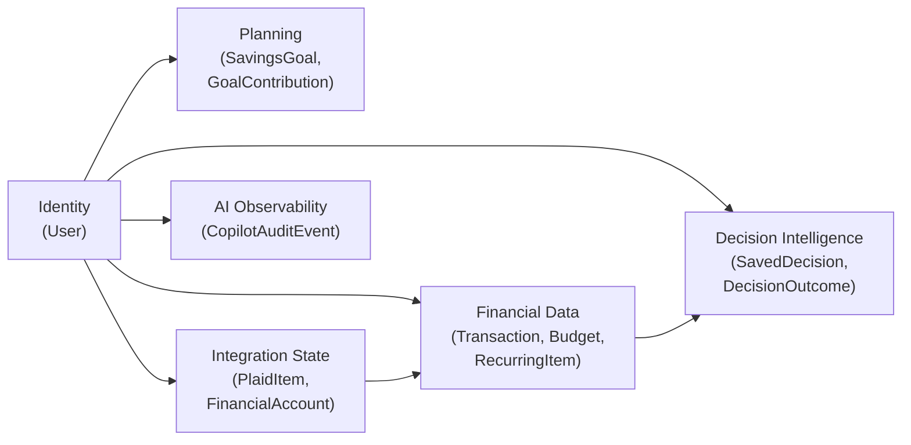
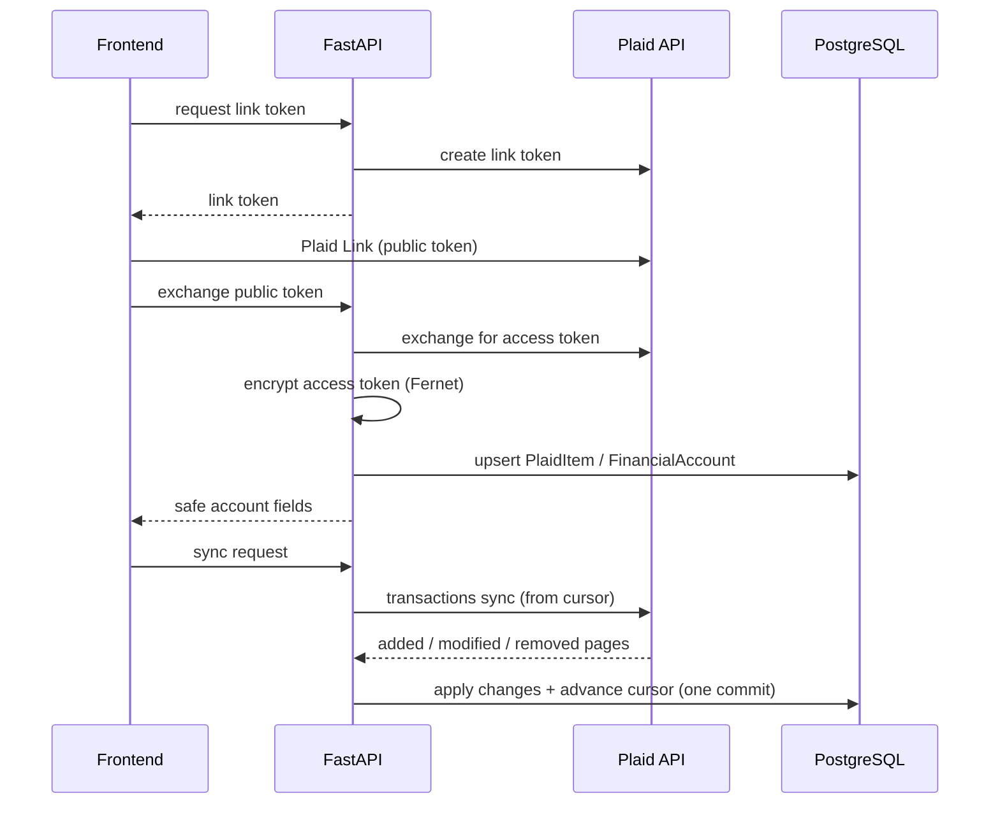

# Discero Architecture

Discero is a financial decision-intelligence platform: a Next.js frontend and a FastAPI backend that combine account, budget, and obligation data into deterministic simulations of how a proposed decision — a purchase, an income loss, a multi-step plan — would affect liquidity, obligations, goals, and financial resilience.

The architecture is built around one invariant: **financial truth is deterministic**. Every balance, Safe-to-Spend figure, affordability verdict, stress-test outcome, or recommendation is computed by a backend service in integer cents. A language model may interpret a user's question, select which deterministic tool to run, and narrate an already-computed result in plain language — it never calculates, estimates, or overrides a financial figure itself. This principle shapes the Copilot trust boundary (§6) and is enforced in code, not just prompt wording.

The backend is a single FastAPI application — a modular monolith with domain-separated routers and services, not a microservice mesh. Persistence is PostgreSQL via SQLAlchemy 2/Alembic; rate limiting is Redis/Valkey-backed with a local fallback; Plaid supplies linked-account data; an LLM provider abstraction supplies optional narration.

## 1. System Overview

The frontend is a Next.js 16 / React 19 App Router application deployed on Vercel. It holds a short-lived Bearer access token in memory/client state and relies on an HttpOnly refresh-token cookie for session renewal; a proxy layer (`frontend/proxy.ts`) issues a per-request CSP nonce and security headers ahead of every page.

The backend is a FastAPI application deployed on Render. `app/main.py` registers CORS, security headers, a request-body-size ceiling, and seventeen domain routers covering authentication, financial data (transactions, accounts, budgets, goals, recurring items), decision-intelligence services, and Copilot orchestration. Business logic lives in `app/services/`, separated by domain responsibility rather than by deployable unit.

PostgreSQL (via SQLAlchemy 2 and a linear Alembic migration history) is the system of record for identity, financial data, saved decisions, and Copilot audit events. Redis/Valkey backs a distributed sliding-window rate limiter for abuse-prone endpoints, with an in-process fallback if Redis is unreachable. Plaid supplies linked bank account and transaction data, synchronized via cursor-based incremental sync. A configurable provider abstraction (Groq, Anthropic, or a fully deterministic free mode with no external call) supplies optional LLM narration for the Copilot, gated by a grounding validator that rejects any narration not traceable to the real computed result.

Every decision-intelligence capability — Safe-to-Spend, Major Purchase, Buy Now vs Wait, Scenario Comparison, Financial Stress Testing, Multi-Step Scenario Planning, Decision Outcome Tracking, Decision Calibration, Decision Portfolio Intelligence, and Financial Resilience — is a dedicated backend service, not a variant of one generic calculator, directly reachable through the REST API. A supported subset of these is additionally exposed through the Copilot's deterministic tool router; the remainder (including Multi-Step Scenario Planning and Decision Portfolio Intelligence) is REST-only today.

## 2. System Context



Ordinary authenticated requests carry only the Bearer access token; the HttpOnly refresh cookie is sent solely to the `/users/refresh` and other `/users`-scoped session-renewal endpoints, never on general API calls (see §7).

The frontend never talks to PostgreSQL, Redis, Plaid, or Groq directly — every external dependency is mediated by the FastAPI backend. There is no message queue, event bus, API gateway, or service mesh in this system; the backend is one deployable process per instance.

## 3. Production Deployment Topology



The frontend is built and hosted on Vercel; the backend runs as a Render Web Service behind Render's own edge, which is the sole public ingress to the container (see §7 for why this matters to IP-based rate limiting). `backend/start.sh` runs `alembic upgrade head` before starting Uvicorn on every deploy, so schema migrations apply ahead of traffic; the Dockerfile-based image starts Uvicorn directly and does not run migrations itself. The application exposes `/health` (process liveness, no database access) and `/health/ready` (confirms database connectivity) for the host's health checks. PostgreSQL and Redis/Valkey are external managed dependencies reached over the network, not services co-located in the same container or dyno.

## 4. Backend Architecture

Discero currently uses a modular-monolith backend. FastAPI hosts domain-specific routers and services in a single deployable application; business logic is separated by domain responsibility, not by network boundary. Nothing described below is an independently deployed service.



Routers in `app/routers/` (users, transactions, accounts, budgets, goals, recurring, plaid, safe_to_spend, major_purchase, financial_stress_test, financial_resilience, goal_conflict_detection, recurring_intelligence, spending_anomalies, what_if, recommendations, copilot, decisions) handle HTTP concerns — request validation, authorization, response shaping — and delegate computation to `app/services/`. Cross-cutting concerns (authentication, rate limiting, request-size limits, production configuration validation) apply uniformly across routers rather than being reimplemented per domain.

## 5. Deterministic Decision Architecture

```
Financial state (accounts, transactions, budgets, goals, recurring obligations)
    -> deterministic domain service (Safe-to-Spend, stress test, scenario, ...)
    -> time-aware simulation (where a decision spans dates)
    -> structured result (Pydantic schema, integer cents)
    -> persistence (saved decision, outcome) / API response / Copilot narration input
```

Safe-to-Spend (`app/services/safe_to_spend_service.py`) is the foundational primitive: it derives a liquid balance from active depository/cash Plaid accounts, subtracts upcoming recurring obligations, essential spending, and a safety reserve, and produces a confidence-scored result. Major Purchase, Buy Now vs Wait, Scenario Comparison, and Financial Stress Testing all evaluate against that same Safe-to-Spend computation rather than each maintaining an independent notion of "what can I afford."

Time-aware simulation (`app/services/time_aware_financial_simulation_service.py`) is the shared temporal engine underlying Multi-Step Scenario Planning and Buy Now vs Wait's "wait" branch: it walks known recurring obligations and income chronologically between two dates using only already-deterministic Discero data, never predicting discretionary spending or investment performance. Multi-Step Scenario Planning and Decision Portfolio Intelligence both reuse Safe-to-Spend's raw (pre-clamp) total and sum deltas against one shared baseline before a single final clamp, so a compounding shortfall across steps or decisions is never silently understated by clamping each one independently.

Acted-on decisions are persisted (`SavedDecision`) and can be re-evaluated later: Decision Outcome Tracking re-runs a decision's original saved input against current data and stores a structured comparison, never a client-supplied "current" result. Decision Calibration is a read-model over already-persisted outcome rows — it recomputes accuracy statistics from stored comparison data and never re-runs a simulation or accepts client-supplied numbers.

Formulas, thresholds, and exact field-level behavior are intentionally out of scope here — see [API_REFERENCE.md](API_REFERENCE.md) and the service modules themselves.

## 6. Copilot Trust Boundary



Each Copilot turn makes at most two provider calls, both structured tool-use, never free-form generation of a financial figure: a DECIDE call selects one deterministic tool (or a clarification/out-of-scope response) from a fixed registry, and — only if a financial tool ran — a NARRATE call is shown that tool's real, already-computed result and asked to phrase it in plain language. Structured figures shown to the user (chips, cards) are built directly from the real result in Python, never parsed out of the model's prose; the model's prose narration is separately checked before it reaches the response.

A grounding validator (`_narration_is_grounded` in `app/services/copilot_service.py`) checks every dollar figure and percentage the model states in its prose against the real payload it was shown. Unsupported monetary or percentage claims cause the entire narration to be rejected before it is returned to the user, and a deterministic template narration is substituted in its place. When no provider is configured, or a provider call fails, that same deterministic router and template narration (`copilot_free_mode`) answers instead — the computed financial answer is identical whether or not an LLM is in the loop.

The tool schema exposed to the model excludes user identity: every tool executes against the `user_id` from the already-authenticated request, never a value the model supplies. This mirrors the same ownership-scoping enforced at the REST layer (§7) — the LLM has no path to select whose data a tool call touches.

## 7. Authentication and Request Security

Login issues a short-lived HS256 access token (`Bearer`, default 60-minute expiry) and sets a longer-lived refresh token in an HttpOnly cookie scoped to `/users`. Access tokens are sent explicitly in the Authorization header rather than as an ambient authentication cookie, reducing CSRF exposure for ordinary authenticated API requests; every route other than `/users/refresh` relies on this Bearer header alone. `POST /users/refresh` validates request origin against the configured CORS allowlist (defense-in-depth for the one endpoint authenticated purely by an ambient cookie), reads the refresh cookie, and issues a new access token plus a rotated refresh cookie that replaces it in the browser. Refresh tokens are stateless JWTs identified only by user id, `token_version`, and expiry — there is no persisted refresh-token-family or reuse-detection table, so successful rotation does not, by itself, mark the previous refresh token as consumed; a previously issued refresh token remains cryptographically valid, governed by its own expiry and by the user-level `token_version` invalidation mechanism below, until one of those revokes it. Passwords are hashed with Argon2 (`pwdlib`'s recommended hasher).

Session invalidation is server-side via a per-user `token_version` integer: password/email change and logout increment it, which immediately invalidates every previously issued access and refresh token regardless of expiry, without a server-side session table. Protected resource access is scoped to the authenticated user at the route and/or query layer (e.g. `WHERE user_id = :authenticated_user`), and no request schema accepts a client-supplied ownership field.

Rate limiting (`app/rate_limit.py`) applies per-IP to public/anonymous endpoints (login, register, password reset) and per-IP **and** per-authenticated-user, independently, to expensive authenticated endpoints (Copilot chat, CSV upload, Plaid link/exchange/sync) — either bucket being exceeded rejects the request. See §10 for the Redis/local-fallback design.

The frontend proxy (`frontend/proxy.ts`) issues a per-request nonce and a strict Content-Security-Policy (`script-src` nonce + `strict-dynamic`, no wildcard origins beyond Plaid's own CDN/API domains) ahead of every page response. The backend adds `X-Content-Type-Options`, `X-Frame-Options`, `Referrer-Policy`, and HSTS (when the request is HTTPS) to every response, and refuses `APP_ENV=production` startup if the JWT secret is left at its development default, CORS includes a wildcard or localhost origin, or Plaid is configured without an encryption key set.

Cookie contents, signing keys, and other operational secrets are intentionally not detailed here — see [SECURITY.md](../SECURITY.md) for the full threat model.

## 8. Data Architecture



PostgreSQL is the production system of record, accessed through SQLAlchemy 2 with a linear Alembic migration history (currently head `fcca0ee66f34`, adding decision outcome tracking). Core financial amounts are represented as signed integer cents at persistence and at every deterministic-computation boundary (`app/money.py`), which keeps floating-point rounding error out of financial decision calculations; raw user-supplied text (e.g. a dollar amount typed into Copilot free-text) may pass through a float momentarily during parsing before being rounded to integer cents, and non-financial figures such as confidence scores and percentages are represented as floats throughout.

Identity (`User`) owns every other domain via cascading foreign keys. Financial data (`Transaction`, `Budget`, `RecurringItem`) and integration state (`PlaidItem`, `FinancialAccount`) feed the decision-intelligence services described in §5. Planning data (`SavingsGoal`, `GoalContribution`) tracks goals as a running sum of dated contribution rows rather than a directly mutated balance column. Decision intelligence persists both the decision as saved (`SavedDecision`, storing its input and result snapshots) and each later re-evaluation (`DecisionOutcome`, always computed server-side from a deterministic re-run — never accepted from the client). `CopilotAuditEvent` stores bounded per-turn metadata (tool used, latency, token counts, success/failure) — deliberately never the user's prompt text, the model's prose answer, or raw financial payloads.

Multi-row mutations that must not partially apply — Plaid sync applying a page of added/modified/removed transactions and advancing the sync cursor, or a bulk transaction category/delete operation — commit as a single database transaction.

## 9. Plaid Integration



Access tokens are encrypted at rest (Fernet, via `TOKEN_ENCRYPTION_KEY`) and never returned in any API response; safe account/status payloads expose only names, types, masks, and balances. Synchronization is cursor-based: a sync claims the item atomically (rejecting a concurrent or too-recent claim), pages through every available cursor update, applies changes and advances the cursor in one commit, and rolls back cleanly on failure while separately recording a bounded, safe error summary. `ITEM_LOGIN_REQUIRED` marks the connection as needing reconnection rather than failing silently. All Plaid operations are scoped to the requesting user's own items.

## 10. Rate Limiting and Resilience

Rate limiting is backend-agnostic by design (`app/rate_limit.py`): an in-process sliding-window counter is the default (sufficient for local dev/test/CI, but not coordinated across instances), and setting `REDIS_URL` switches every rate-limited endpoint to a Redis-backed sliding window implemented as a single atomic Lua script — preventing the read-then-write race that would let concurrent requests both slip under a stale count.

If Redis becomes unreachable, the limiter falls back to the same in-process limiter for a short cooldown before automatically retrying Redis — a Redis outage degrades to per-instance enforcement rather than becoming unlimited traffic, and never fails open. This is a deliberate trade-off: during a Redis blip, multiple backend instances briefly stop coordinating with each other and each enforces its own bounded window, rather than the alternative of failing the whole API closed or allowing unbounded requests. Expensive authenticated endpoints are limited by IP and by authenticated user independently; public auth endpoints are limited by IP only. Redis/Valkey is used exclusively for rate-limit counters — it is not an application session store.

## 11. Observability and AI Evaluation

The Copilot pipeline records two independent kinds of telemetry, both scoped to a single turn. `copilot_audit` persists a bounded row per turn to PostgreSQL — tool used, intent, success/error code, latency, model, tool-call count, response kind — deliberately excluding prompt text, model prose, or raw financial payloads. `copilot_observability` is a DB-free layer that reads token-usage and latency metadata already present on the provider's response object and computes estimated cost only when both an input and output per-million-token rate are explicitly configured; it never estimates a token count or fabricates a cost figure when those rates are unset. Grounding behavior (§6) is covered by dedicated regression and evaluation tests rather than trusted to prompt wording alone.

No distributed tracing platform, external APM, or log-aggregation service is integrated at the application layer; observability here is limited to the audit/telemetry described above plus whatever the hosting platforms (Render, Vercel) provide natively.

## 12. CI/CD and Production Safety

GitHub Actions (`.github/workflows/ci.yml`) runs on every push to `main` and every pull request: a backend job (Python 3.12) installs dependencies and runs the pytest suite with `APP_ENV=test`; a frontend job (Node 24) runs lint, the Vitest suite, and a production `next build`. Dependabot tracks weekly updates for pip (backend), npm (frontend), and GitHub Actions dependencies.

Deployment is Vercel for the frontend and Render for the backend. `backend/start.sh` applies `alembic upgrade head` before starting Uvicorn on every Render deploy, so the running application never serves traffic against an un-migrated schema; the container also exposes `/health` and `/health/ready` for the host's health checks (§3). The repository has no checked-in `vercel.json` or Render blueprint — hosting-platform configuration (environment variables, branch protection, secret scanning) lives in each platform's dashboard rather than in source, and is covered operationally in [SECURITY.md](../SECURITY.md) rather than here.

## 13. Key Architectural Decisions

| Decision | Rationale | Trade-off |
|---|---|---|
| Modular monolith (not microservices) | One deployable FastAPI app keeps domain services able to share deterministic primitives (Safe-to-Spend, time-aware simulation) directly, in-process, without a network hop or API versioning between services | Cannot scale or deploy individual domains independently; the whole application scales as one unit |
| Deterministic finance core, LLM narration separated | A financial platform cannot let a language model invent a balance or a recommendation; narration is generated only after the real result exists and is checked against it | Narration quality is bounded by what the structured result payload contains; the model cannot add computation the payload doesn't already support |
| Integer-cent monetary representation | Eliminates floating-point rounding error in every financial calculation | Requires disciplined parsing at every input boundary (`app/money.py`) rather than accepting raw decimals throughout |
| PostgreSQL + Alembic, linear migration history | Single, auditable schema history; straightforward `alembic upgrade head` on deploy | Migrations must be written and reviewed sequentially; no branching schema history |
| Redis/Valkey-backed rate limiting with local fallback | Horizontal scaling requires shared counters across instances; a Redis outage must never become unlimited traffic on a financial API | Fallback mode is per-instance, not globally coordinated, for the duration of a Redis outage |
| Encrypted Plaid access tokens (Fernet) | Plaid tokens are long-lived bearer credentials for real bank data and must not be stored in plaintext | Key rotation currently requires re-linking affected connections rather than transparent re-encryption (see §14) |
| Short-lived access token + HttpOnly refresh cookie | Access tokens are sent explicitly via the Authorization header rather than as an ambient cookie, reducing CSRF exposure for ordinary authenticated requests; the refresh cookie is inaccessible to JS, limiting XSS blast radius | No server-side refresh-token-family table, so rotation does not individually invalidate a previously issued refresh token — it remains valid until its own expiry or a `token_version` bump (see §14) |
| Time-aware simulation as a shared primitive | Multi-Step Scenario Planning and Buy Now vs Wait both need the same chronological-walk semantics; a single engine guarantees they never diverge | Any new date-spanning decision feature must be built on this engine rather than a bespoke date-math implementation |

## 14. Known Architectural Boundaries / Future Evolution

- Refresh tokens are rotated stateless JWTs, not a server-side session table — a previously issued refresh token is not individually invalidated by rotation and remains cryptographically valid, governed only by its own expiry and the user-level `token_version`, until one of those revokes it. There is no persisted refresh-token-family record, so a leaked-and-later-replayed refresh token is not detected or flagged as a replay incident. A per-session table would close this gap.
- `TOKEN_ENCRYPTION_KEY` rotation is not yet transparent: existing encrypted Plaid tokens become unreadable if the key is replaced outright, so a rotation currently implies re-linking affected connections rather than dual-key (current + previous) decryption.
- No first-party MFA/passkey support; account takeover risk today is bounded by password strength, rate limiting, and full session revocation on password change.
- The rate-limit fallback (§10) is per-process during a Redis outage — a deliberate, bounded trade-off rather than a gap to be silently relied upon.
- The backend intentionally remains a modular monolith; splitting a domain into an independently deployed service is a future option, not a current architecture, and would need its own consistency story for the deterministic primitives multiple domains currently share in-process.

See [SECURITY.md](../SECURITY.md) for the full threat model and residual security risks.
